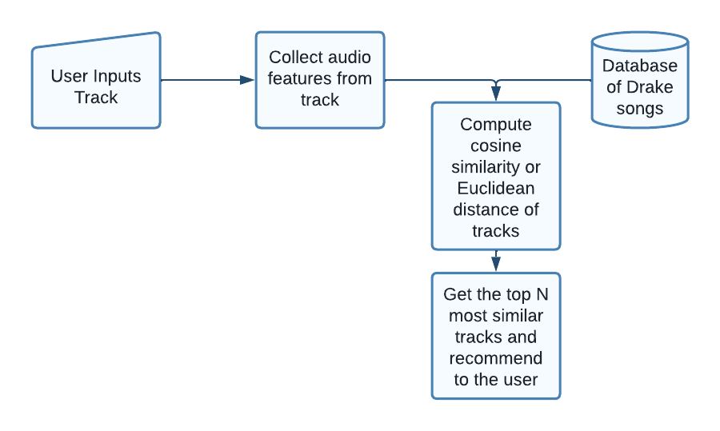
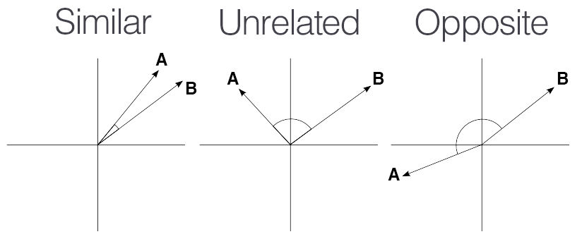
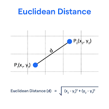

# **Currently Working On...**
Testing a neural network to recommend songs
# **Drake-recs**

## **About this Project**
This project helps users get more personalized recommendations for specifically Drake songs. To read a more detailed analysis on the creation of this recommendation system, scroll down to the Analysis section.

## **Usage of streamlit app**
To use the recommendation system for yourself, check out LINK:

1. Enter a Drake song that you like
2. Choose the number of songs you want recommended to you
3. Click the Get Recommendations button
4. Listen to the recommendations

## **Analysis of Drake recommendation system**

### **Overall structure of recommendation system**
The basic structure structure of the recommendation system is as follows:

The recommendation system computes the cosine simliarity of the inputted track and and all other Drake songs in the database based on features such as danceability, energy, key, loudness, speechiness, acousticness, instrumentalness, liveness, valence, and tempo. Currently, only songs made by Drake are in the database (features are not included) 

#### **Why cosine similarity?**
Cosine similiarity was tested in the recommendation system because after doing a quick search, it seemed to be a common approach to recommendation systems. The basic idea is that it expresses each song as a feature vector, and it calculates the similarity of 2 song feature vectors by the cosine of the angle between the 2 feature vectors. 

The advantages to using cosine similarity is that it is computationally efficient, can handle multiple features, and it is not affected by the magnitude of the vectors being compared, since only the angle matters. For example, let's say Song A has high loudness and moderate danceability, and Song B has low loudness and low danceability. Though Song A and B have different magnitudes of loudness and danceability, it is possible that the way loudness and danceability are proportionally distributed in both songs is simliar. Cosine similiarity will be able to capture this similarity between the songs, as it does not care about magnitude.

The disadvantages of cosine similarity is that it doesn't work well with categorical or ordinal features, so it limits important features we could use such as genre. Another limitation is that it assumes that all features are equally important. If there truly is a stronger relationship between danceability and the true song similiarity for example, cosine similarity will not account for this. Additionally, cosine similarity is primarily used on textual data, and the audio features used were mostly quantitative.

#### **Why euclidean distance?**
Euclidean distance was also tested because it is a different approach to measuring song similarity. Instead of looking at the orientation (angle) of song feature vectors, euclidean distance recommends songs that have similar feature values. In this case, if Song A and B had relatively the same danceability and loudness, but Song A had high danceability and loudness and Song B had low danceability and loudness, they would not be similar based on a euclidean distance approach because the magnitude of the features matters. Euclidean distance, as the name suggests, calculates the Euclidean distance between 2 points. The shorter the distance, the more similar songs are.

Some advantages to euclidean distance is that it is robust to outliers, has a clear interpretation, is relatively efficient, and works well with continuous features. It also allows features to be weighted differently. However, our purposes, all features were weighted equally because the data was scaled before calculating euclidean distance. The data was scaled because I wasn't sure which features contributed the most to "similarity" between songs.

The disadvantages of euclidean distance are that it can still be influenced by outliers, does not work well when a lot of features are 0, and assumes a linear relationship between the features. It also does not work well with categorical or ordinal features. Euclidean distance is also susceptible to the curse of dimensionality, which makes it harder to find similarities between songs because when there are more dimensions, the songs (represented as points) are generally going to be farther apart.

### **The Data and Assumptions**
The data was collected using the Spotify web API and the spotipy library. To see the code, check out data_processing.py and user_playlist_dataset.py.

The drake_songs_dataset.csv was the dataset of Drake tracks that the recommendation system would pull from to recommend based on the user's inputted track.

playlist_1.csv to playlist_5.csv were popular playlists made by users containing Drake songs that captured the moods of Sad, Hype, Chill, Romantic, and Party respectively. These different playlist datasets were used to evaluate the recommendation system's performance. 

### **Testing the recommendation system**

To test my recommendation system, I used an offline evaluation method. I collected data from playlists created by users that contained only Drake songs. Each playlist fit a specific mood of Drake. I would then split each playlist into training and testing datasets, to see if my model could recommend the correct songs based on the training data.

Because my recommendation system works by inputting only 1 song and generating for example 5 recommendations, to test the performance of the system on an entire playlist, the playlist will be split into train and test data. I will run the system on each song in the train data, and add the recommendations to a list. Then, I will check if those recommendations are present in the test data.

I subjectively determined that ths following moods were the primary moods present in Drake songs:
Playlists from users to test recommendation system:

- Sad: https://open.spotify.com/playlist/5lWxcrl0MTLPS6iEtzYMb6
- Hype: https://open.spotify.com/playlist/0t06SW8VdtNeluu1qSFSNg
- Chill: https://open.spotify.com/playlist/2XF1Qyb2mk2bAi7D0cvhoz
- Romantic: https://open.spotify.com/playlist/2WnlmsV0BPt6ydSYK5AoCT
- Party: https://open.spotify.com/playlist/35WYwjJedrQevOlzBNmXt5

The assumption about this data is that the songs in the playlist accurate capture the mood. I subjectively determined this by listening to a few songs in each playlist. A limitation with this project is that I only used 1 playlist per mood. The problem with this is that different people can think that the same song can convey a different mood. Sampling the most popular playlist for each mood was my "fix" to this, but in the future, I would collect more data (more playlists) per mood to get a more accurate idea of what each mood .

